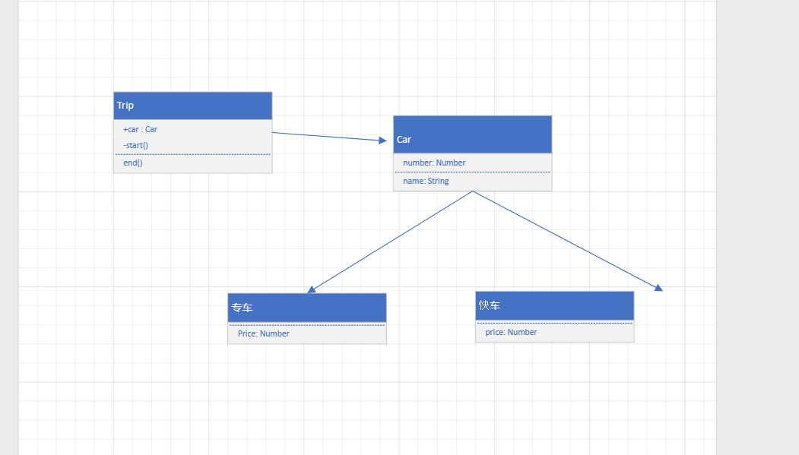
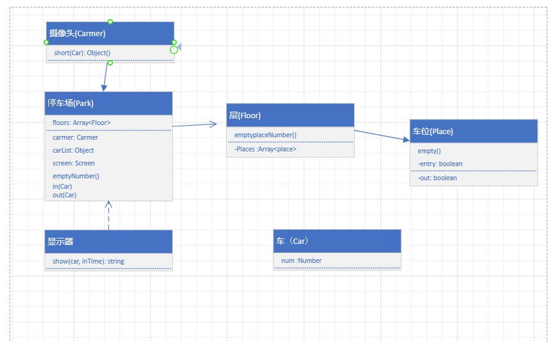

# React + Vite

## 从设计到模式
## 设计模式分组 
  - 创建型 
    - 工厂模式
    - 单例模式
    - 原型模式
  - 组合型
    - 适配器模式
    - 装饰器模式
    - 代理模式
    - 外观模式
    - 桥接模式
    - 组合模式
    - 享元模式
  - 行为型
    - 策略模式
    - 模板方法模式
    - 观察者模式
    - 迭代器模式
    - 职责连模式
    - 命令模式
    - 备忘录模式
    - 状态模式
    - 访问者模式
    - 中介者模式
    - 解释器模式
## 如何学设计模式
1. 明白每个设计的道理和用意
2. 多思考，尽力不模仿
   

## 面试
- 打车时，可以打专车和快车，任何车都有车牌号和名称。
- 不同的车价格不同， 快车每公里1元，专车每公里2元。
- 行程开始时，显示车辆信息
- 行程结束时，显示打车金额（假定行程有5公里）

1 画出UML 类图
2， 用ES6 语法写出改示例

> 某停车场， 分三层，每层100个车位
> 每个车位都能监控到车辆的驶入和离开
> 车辆进入前，显示每层的空余车位数量
> 车辆进入时，摄像头可以识别车牌号和时间
> 车辆出来时，出口显示器显示车牌号和停车时长
- 画出UML 类图
- 
  
