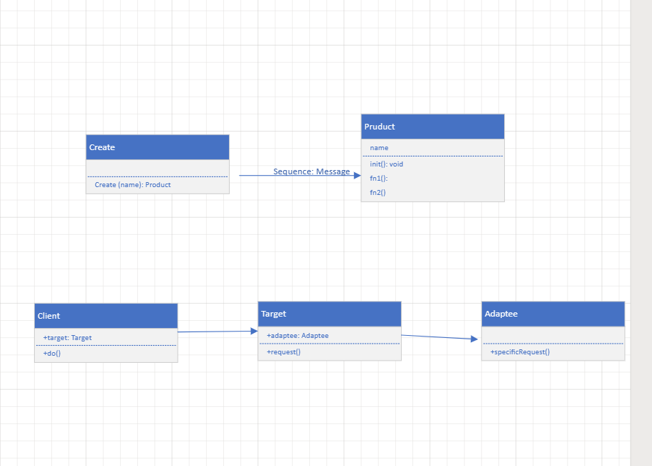
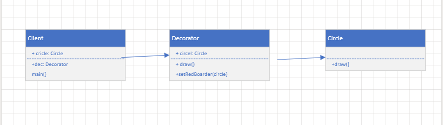
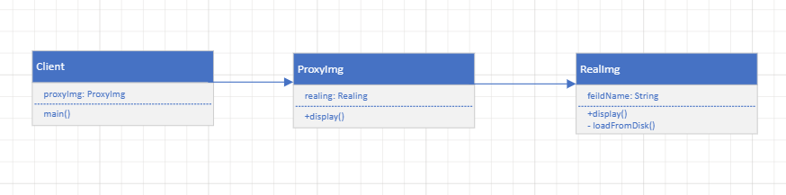
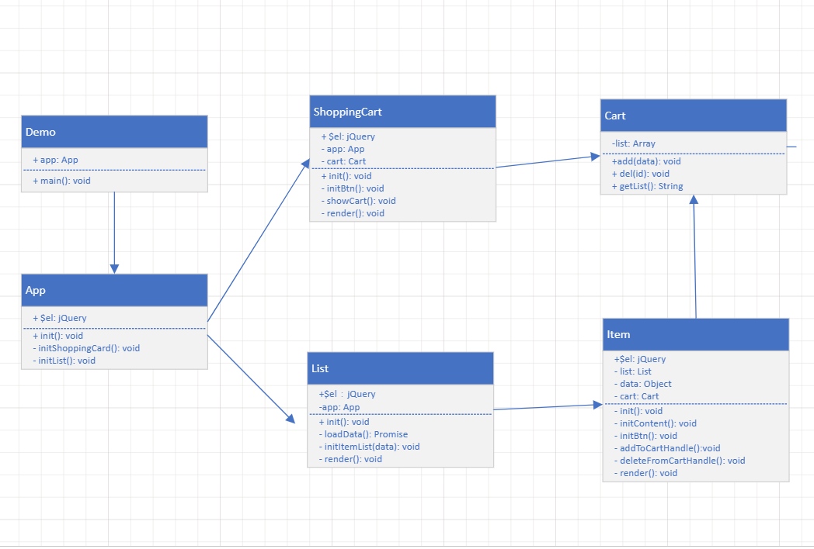

# React + Vite

## 从设计到模式
  - SOLID  S 单一职责原则 O 开放封闭 L 里氏置换原则 I 接口独立原则 D依赖倒置原则
## 设计模式分组 
  - 创建型 
    - 工厂模式
    - 单例模式
    - 原型模式
  - 组合型
    - 适配器模式
    - 装饰器模式
    - 代理模式
    - 外观模式
    - 桥接模式
    - 组合模式
    - 享元模式
  - 行为型
    - 策略模式
    - 模板方法模式
    - 观察者模式
    - 迭代器模式
    - 职责连模式
    - 命令模式
    - 备忘录模式
    - 状态模式
    - 访问者模式
    - 中介者模式
    - 解释器模式
## 如何学设计模式
1. 明白每个设计的道理和用意
2. 多思考，尽力模仿
   

## 面试
- 打车时，可以打专车和快车，任何车都有车牌号和名称。
- 不同的车价格不同， 快车每公里1元，专车每公里2元。
- 行程开始时，显示车辆信息
- 行程结束时，显示打车金额（假定行程有5公里）

1 画出UML 类图
2， 用ES6 语法写出改示例


> 某停车场， 分三层，每层100个车位
> 每个车位都能监控到车辆的驶入和离开
> 车辆进入前，显示每层的空余车位数量
> 车辆进入时，摄像头可以识别车牌号和时间
> 车辆出来时，出口显示器显示车牌号和停车时长
- 画出UML 类图
- 


## 工厂模式
- 将New 操作单独封装
- 遇到new 时，就要考虑是否该使用工厂模式。
## 单例模式
- 只能内部new, 并且只能new 一次
## 适配器模式 
- 适配器模式（Adapter）是将一个类（对象）的接口（方法或属性）转化成客户希望的另外一个接口（方法或属性），适配器模式使得原本由于接口不兼容而不能一起工作的那些类（对象）可以一些工作。
- 旧接口格式和使用者不兼容
- 中间加一个适配转换接口


## 装饰器模式
- 为对象添加新功能
- 不改变其原有结构和功能 

- 场景 ES7 装饰器  https://medium.com/google-developers/exploring-es7-decorators-76ecb65fb841
  ```js
    @decorator
    class A {}

    //等同于
    class A {}
    A = decorator(A) || A;

  ```
## 代理模式
- 使用者无法访问目标对象
- 中间加代理，通过代理做授权和控制
- 

> 代理模式 提供一模一样的接口  2， 直接针对原有功能，限制以后的
> 装饰器模式 提供不一样的接口  2， 扩展功能
>

## 外观模式
- 为子系统中的一组接口提供了一个高层接口
- 使用者使用这个高层接口

## 观察者模式
- 发布 & 订阅
- 一对多
## 迭代器模式
- 顺序访问一个集合
- 使用者无需知道集合内部的结构（封装）
- for of 遍历Iterator

## 状态模式
- 一个对象有状态变化
- 每次状态变化都会触发一个逻辑
- 不能总是用if else 来控制

## 其他设计模式
- 不常用
- 对应不到经典的应用场景

## 原型模式
- clone 自己，生成一个新对象

## 组合模式
- 生成树形结构，表示”整体 - 部分“关系
- 让整体和部分都有一致的操作方式

## 享源模式
- 共享内存（主要考虑内存， 而非效率）


## 策略模式
- 不同策略分开处理
- 避免出现大量的if else 或者 switch case


## 综述
